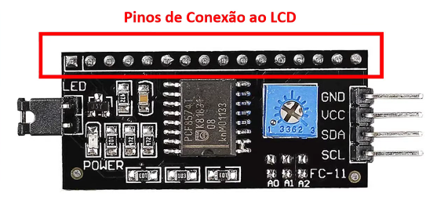
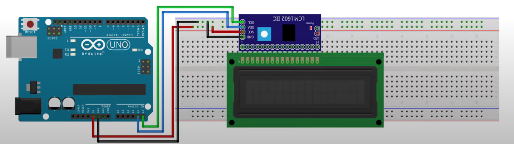
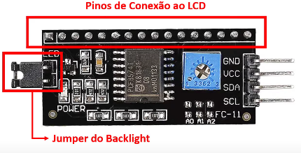
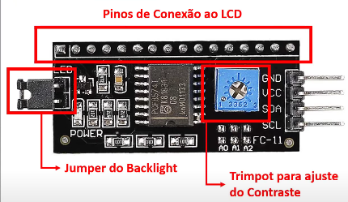
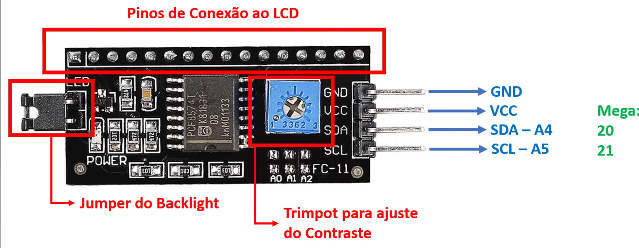

# Modulo I2C - **LCD**
## Caracteriscas
### Pinos de Conexão ao LCD


Eles serão ligados na *mesma posição* dos pinos LCD, como podemos ver abaixo:



### Jumper do Backlight


Primeiramente o que seria backlight?, backlight significa "iluminação de fundo" logo seu proposito e ser um conector ou um jumper que controla a iluminação de fundo de um dispositivo, como os <u>monitores LCD</u>.

### Trimpot para ajuste do Contraste


Na velha ligação sem o modulo I2C, você tinha o velho potenciômetro ligado no terceiro pino do LCD. Você não precisa mais disso com o modulo I2C (se tornou automático).

### Pinos de Ligação


GND e o pino negativo, já o VCC pino positivo.
SDA (Serial Data) é o responsável pela transferência e recebimento de dados. por sua vez, o pino SCL (Serial Clock) é utilizado para temporização das mensagens da tela.

## Biblioteca
### LiquidCrystal_I2C.h
Essa biblioteca facilita muito na programação desse modulo, sem ela você ainda teria que usar o LCD confessional
1. para iniciar o monitor **LCD**
```c++
lcd.init();
```
2. para ligar o backlight (<u>iluminação de fundo</u>)
```c++
lcd.backligth();
```
3. para exibir na tela do monitor **LCD**
```c++
lcd.print("Hello, World");
```
4.  para mudar a coluna e linha do monitor **LCD**
```c++
lcd.setCursor(0, 1);
```
5. para limpar a tela do monitor **LCD**
```c++
lcd.clear();
```
6. para deslocar a mensagem da direita/esquerda, ou ambas
```c++
lcd.scrollDisplayRight(); // direita
lcd.scrollDisplayLeft() // esquerda 
```
7. para retornar para a posição inicial do monitor **LCD**
```c++
lcd.home();
```

## Referencias
🎥 <a href="https://youtu.be/jWE0R7fG4k4?si=tyvBB7pjepWt-oCU"> MÓDULO I2C - Facilitando a sua vida com o Display LCD (ARDUINO BRASIL) </a> <br> <br>
🎥 <a href="https://youtu.be/pcBbJA9G9oM?si=ujbulpn81CvKZ9gU"> Tira Dúvidas como utilizar o Módulo I2c para LCD no Arduino </a>
